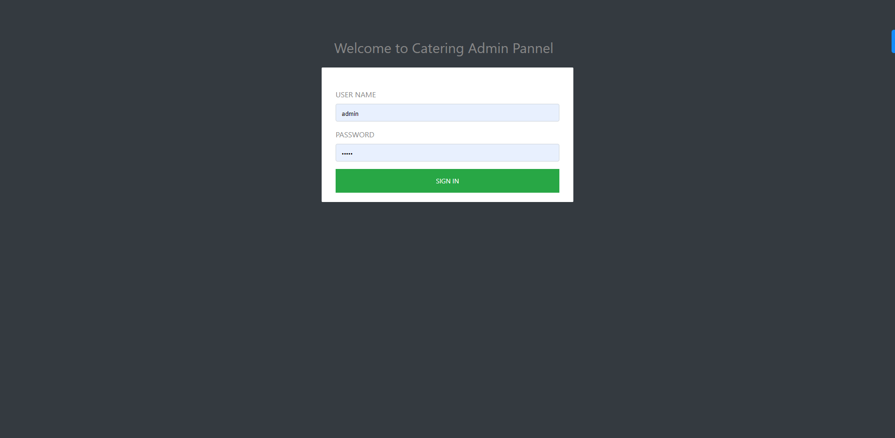
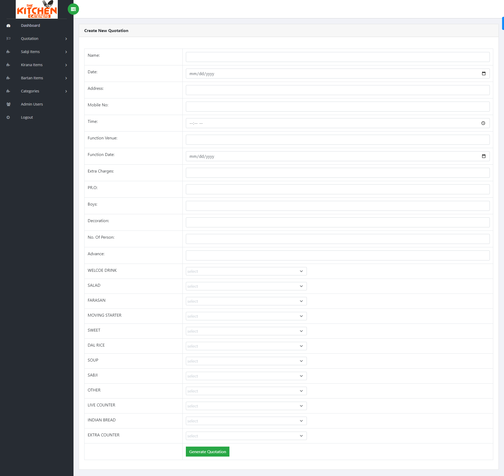
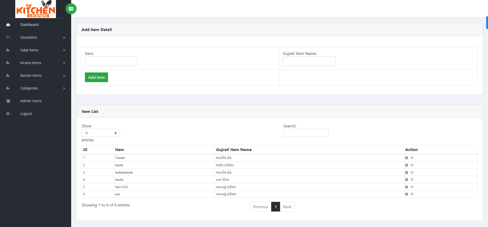

# Catering Management System

Catering Management System is a web-based application that simplifies the process of managing catering orders and generating lists of items to be provided to customers. It allows users to record different catering items and create customized lists based on customer requirements.

## Features

The application offers the following key features:

- **Item Recording:**
  - Users can add and manage a variety of catering items, such as dishes, beverages, desserts, etc.
  - Each item can have details like name, description, price, and availability status.

- **Order Generation:**
  - Users can create customized catering lists for each customer's order.
  - The application calculates the total cost of the order based on the selected items.

- **User Accounts:**
  - Users can create individual accounts to manage their catering items and orders securely.

## Technology Stack

The application is built using the following technologies:

- **Backend:**
  - PHP: Server-side scripting language to handle backend logic and database interactions.
  - MySQL: Relational database management system for storing and managing catering item data.

- **Frontend:**
  - HTML: Markup language for structuring the web pages.
  - CSS: Stylesheet language for styling the web pages.
  - JavaScript: Scripting language to add interactivity to the application.

## Installation and Setup

1. Clone the repository:
2. Import the database:
3. Create a MySQL database and import the provided SQL file catering.sql.
4. Configure the database connection:
5. In the config.php file, update the database credentials with your own:

## Screenshots

## Login Deatils
username: admin
password: admin
